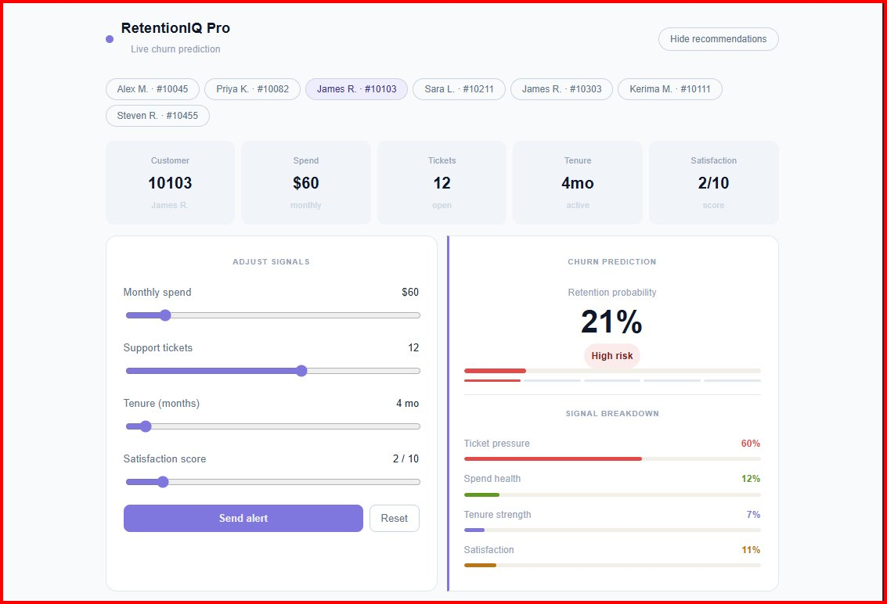
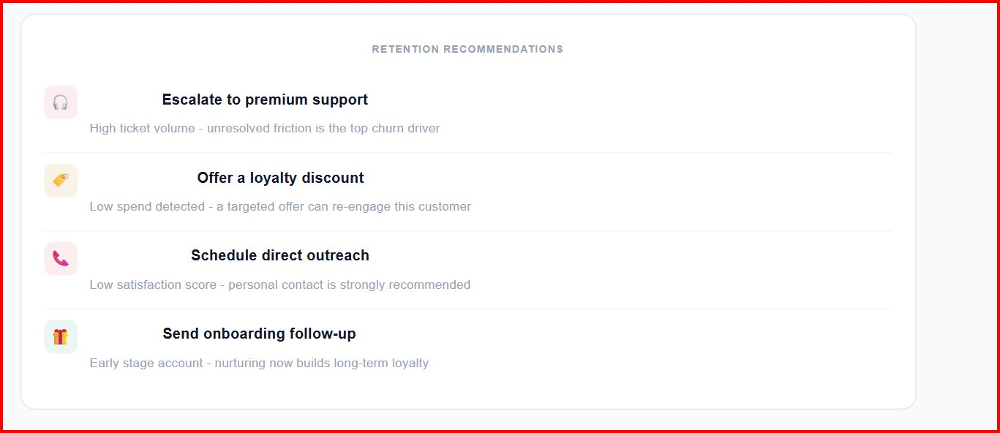

# RetentionIQ Pro

**Predicts which customers are about to leave and tells you exactly what to do about it.**

RetentionIQ Pro is a full-stack customer churn prediction platform. It trains a machine learning model on real customer data, stores results in a local database, and delivers live risk scores and personalized retention recommendations through an interactive React dashboard. An experimental quantum classification module built with Qiskit explores whether quantum computing can improve prediction accuracy over the classical model.

---

## Live Preview





---

## What It Looks Like

The dashboard shows real-time churn prediction with interactive sliders, customer switching, signal breakdown bars, and dynamic retention recommendations all updating instantly in the browser. James R. above is at 21% retention probability with High risk triggered by 12 open tickets and only 4 months of tenure. Four smart recommendations fire automatically based on the current signal values.

---

## Features

**Live churn prediction**
Drag sliders for spend, tickets, tenure, and satisfaction and the retention probability updates in real time alongside color-coded risk signals and a segment indicator.

**Customer switcher**
Multiple pre-loaded customer profiles each with distinct data. Click any pill to load their signals and see how predictions differ.

**Dynamic recommendations**
Recommendations are generated from the current slider values — high tickets triggers premium support escalation, low satisfaction triggers direct outreach, early tenure triggers an onboarding follow-up.

**Alert system**
The Send Alert button fires a color-coded notification — red for high-risk customers flagged to the team, green for healthy customers enrolled in loyalty tracking.

**Quantum module (experimental)**
A Qiskit-powered Quantum Support Vector Machine encodes the same four customer features into qubit amplitudes using a ZZFeatureMap and classifies churn risk. Output is benchmarked against the classical model.

---

## Tech Stack

| Layer | Tools |
|---|---|
| Frontend | React, Vite, CSS |
| Backend | Python, FastAPI |
| Database | SQLite (sqlite3) |
| Classical ML | scikit-learn |
| Quantum ML | Qiskit, Qiskit Machine Learning, Qiskit Aer |
| Data | Excel (Customer Data.xlsx) |

---

## Project Structure

```
RententionIQ-Pro/
    Data/
        Customer Data.xlsx
    frontend/
        src/
            App.jsx
            App.css
            main.jsx
            index.css
            assets/
        index.html
        package.json
        vite.config.js
    quantum/
        quantum_churn.py
        requirements_quantum.txt
    database.py
    main.py
    train_model.py
    churn_model.pkl
    requirements.txt
```

---

## How It Works

**Step 1 — Database**
`database.py` creates `retentioniq.db` with a customers table holding id, name, email, age, tenure, monthly spend, support tickets, satisfaction score, and churn label.

```sql
CREATE TABLE IF NOT EXISTS customers (
    id                 INTEGER PRIMARY KEY AUTOINCREMENT,
    name               TEXT,
    email              TEXT,
    age                INTEGER,
    tenure             INTEGER,
    monthly_spend      REAL,
    support_tickets    INTEGER,
    satisfaction_score INTEGER,
    churn              INTEGER
)
```

**Step 2 — Model training**
`train_model.py` reads `Customer Data.xlsx`, trains a scikit-learn classifier on the four behavioral features, and saves it to `churn_model.pkl`.

**Step 3 — Prediction**
`main.py` loads the trained model, runs predictions across all customer records, and writes churn labels back to the database.

**Step 4 — Dashboard**
The React frontend reads prediction results and renders a live interactive dashboard. All slider changes trigger instant recalculation in the browser with no server round-trip needed.

**Step 5 — Quantum module**
`quantum/quantum_churn.py` encodes the same four features into a quantum circuit using Qiskit's ZZFeatureMap, runs a QSVM, and prints a side-by-side accuracy comparison with the classical model.

```python
from qiskit.circuit.library import ZZFeatureMap
from qiskit_machine_learning.algorithms import QSVM
from qiskit_aer import AerSimulator

feature_map = ZZFeatureMap(feature_dimension=4, reps=2)
qsvm = QSVM(feature_map=feature_map)
qsvm.fit(X_train, y_train)
predictions = qsvm.predict(X_test)
```

---

## Getting Started

**Backend**

```bash
git clone https://github.com/Kerima-001/RententionIQ-Pro.git
cd RententionIQ-Pro
pip install -r requirements.txt
python database.py
python train_model.py
python main.py
```

**Frontend**

```bash
cd frontend
npm install
npm run dev
```

Open [http://localhost:5173](http://localhost:5173)

**Quantum module (optional)**

```bash
pip install qiskit qiskit-machine-learning qiskit-aer
python quantum/quantum_churn.py
```

---

## Dashboard Walkthrough

| Element | What it does |
|---|---|
| Customer pills | Switch between customer profiles instantly |
| Spend slider | Higher spend lowers churn risk |
| Tickets slider | High ticket count raises risk sharply |
| Tenure slider | Longer tenure reduces risk |
| Satisfaction slider | Low scores are the strongest churn signal |
| Probability bar | Live retention % with animated color transition |
| Signal breakdown | Four colored bars showing each feature's contribution |
| Recommendations | Dynamic list that updates with every slider change |
| Send alert | Team notification — red for high risk, green for healthy |
| Reset | Restores all sliders to the customer's original values |

---

## Roadmap

Connect sliders to the FastAPI backend so predictions run through the real model instead of browser-side math. Add a customer list view with sortable churn scores and bulk alerting. Integrate CUDA-Q for GPU-accelerated quantum classification. Export churn reports as PDF or CSV. Add authentication and team-based dashboards.

---

## Author

**Kerima Mussa** — [GitHub](https://github.com/Kerima-001) · [LinkedIn](https://linkedin.com/in/kerima-mussa-a72735277)

> *Building data-driven tools that help businesses make better decisions.*
